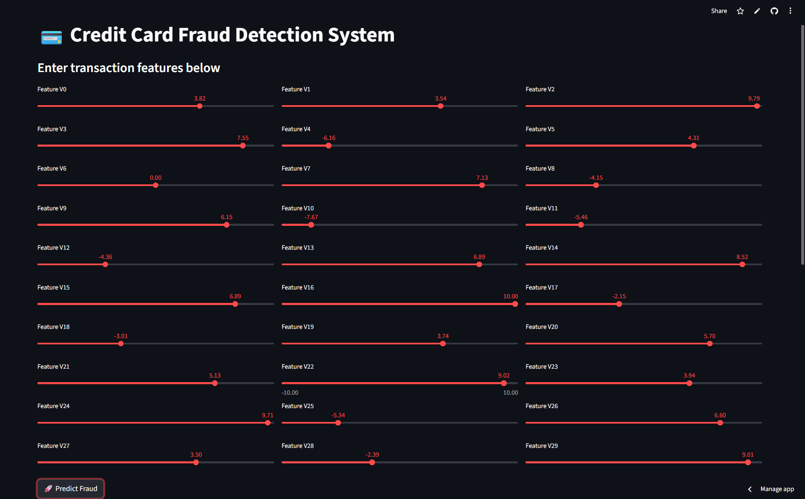
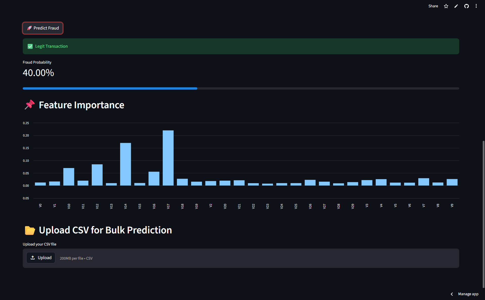

## Problem Statement

Credit card fraud is a major issue in financial systems.  
This project aims to detect fraudulent transactions using a machine learning model and provide real-time predictions through an interactive dashboard.

---

# Credit Card Fraud Detection System

An end-to-end Machine Learning project that detects fraudulent credit card transactions using a trained classification model and provides real-time predictions through a Streamlit web application.

---

##  Live Demo
https://credit-card-fraud-detection-edfsjkcxzynzwvaaosbmpx.streamlit.app/


##  GitHub Repository
🔗 git clone https://github.com/vaibhavdabade932005-netizen/credit-card-fraud-detection.git

---

##  Features
-  Predict fraud in real-time using manual input  
-  Upload CSV for bulk prediction  
-  Displays fraud probability  
-  Fast and interactive UI with Streamlit  

---

##  Model Used
- Random Forest Classifier
- Trained on anonymized transaction dataset
- Handles imbalanced data

---

##  Tech Stack
- Python  
- Scikit-learn  
- Pandas & NumPy  
- Streamlit  

---

##  Project Structure
credit-card-fraud-detection/
│── app.py
│── model.pkl
│── requirements.txt
│── README.md


---

##  How to Run Locally

```bash
git clone https://github.com/your-username/credit-card-fraud-detection.git
cd credit-card-fraud-detection
pip install -r requirements.txt
streamlit run app.py

## Screenshots

### Main Dashboard


### Prediction Result

